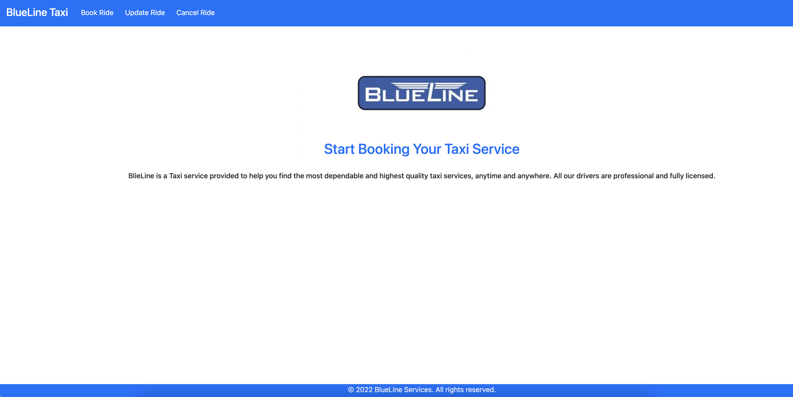
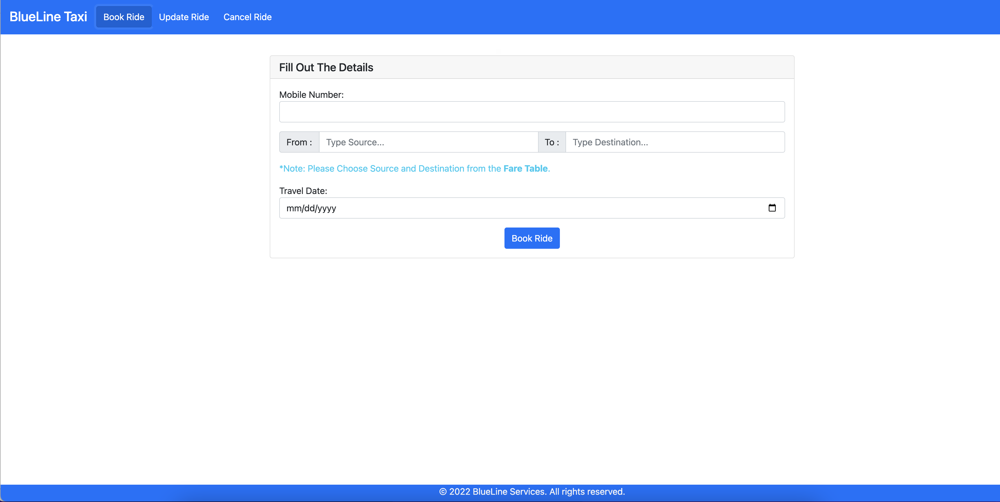
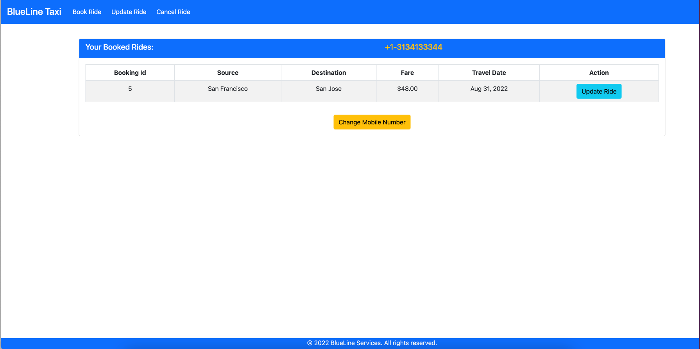
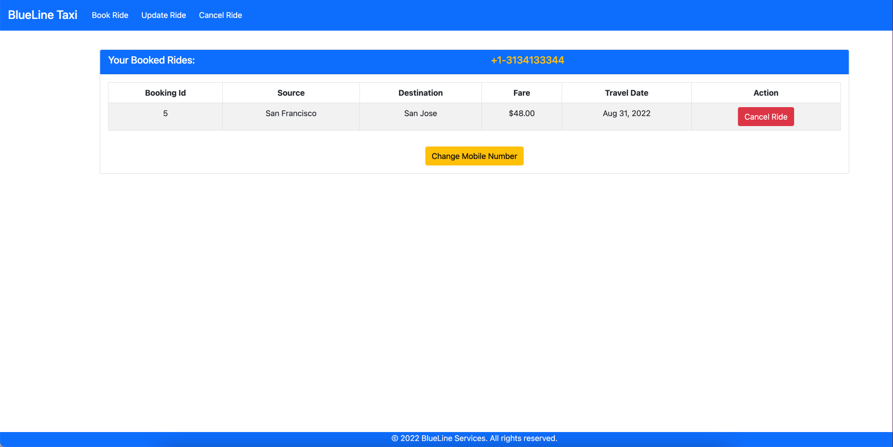

# RK-RC-DW-2022-HACKATHON
Ravali Kuppachi and Rajabhushan Ceelam Project for DeveloperWeek Cloud 2022 Hackathon

## BlueLine is an online taxi booking service.

### blueline-ui
This is the frontend application developed using Angular

### blueline-api
This is the backend application developed using SpringBoot and MySQL

## Services

### Home Screen

User will be able to access different services using the menu on home page

### Booking Screen

User will be able to book taxi service using booking page

### Update Booking Screen

User will be able to update existing booking using update booking page

### Cancel Booking Screen

User will be able to cancel existing booking using cancel booking page

